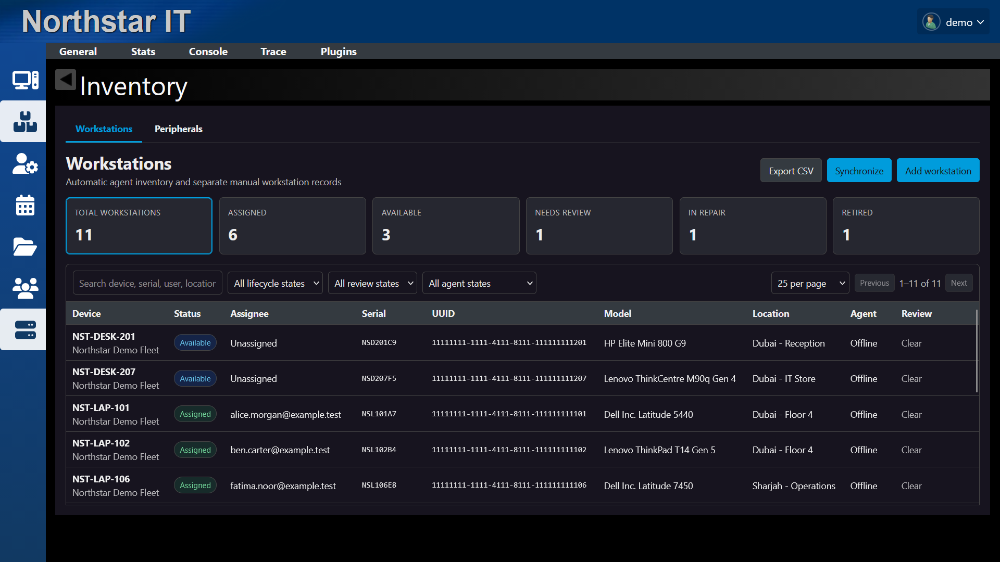
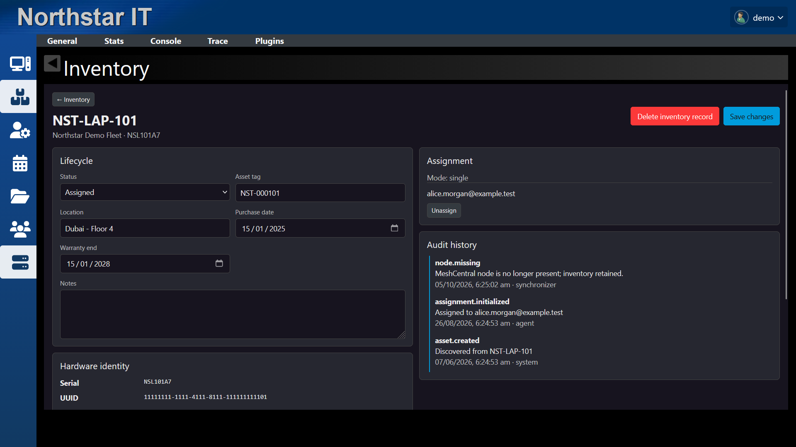
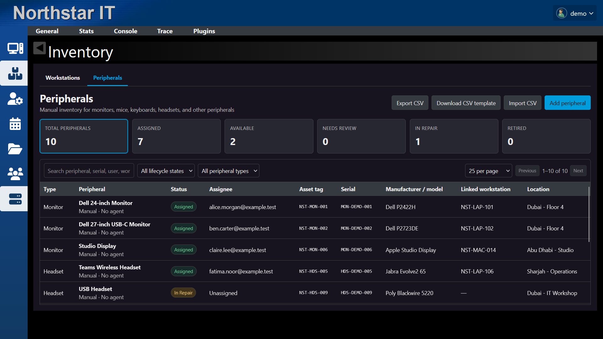
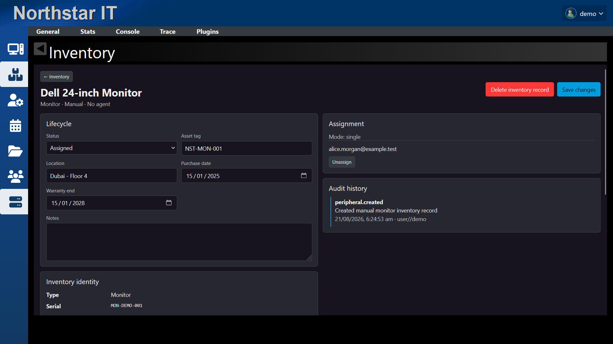
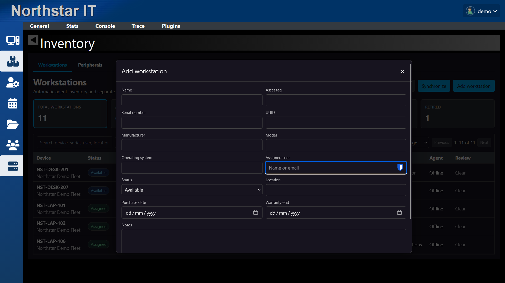
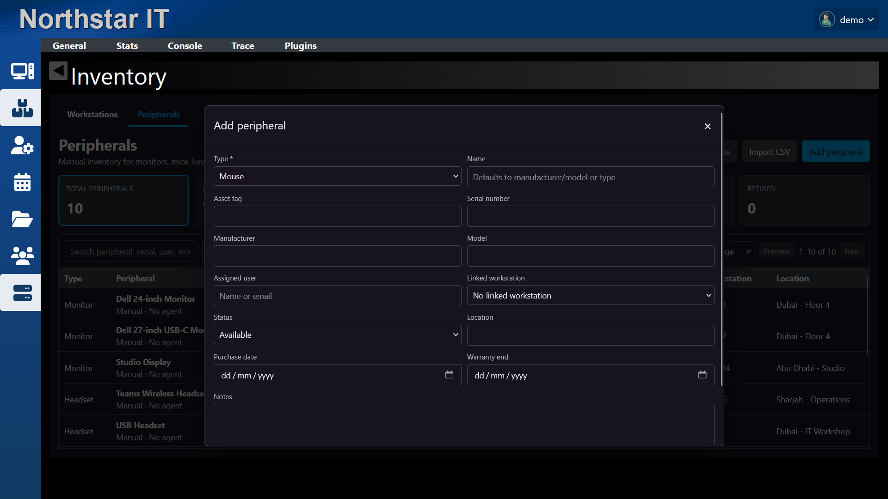

# MeshCentral Inventory

MeshCentral plugin for workstation lifecycle, user assignment, manual workstation records, and peripheral inventory.

## Requirements

- MeshCentral 1.2.5 or later
- Plugins enabled in `meshcentral-data/config.json`:

```json
"plugins": {
  "enabled": true
}
```

Restart MeshCentral after enabling plugins. Do not add Inventory to `settings.plugins.list`; URL installations are managed by MeshCentral's plugin manager.

## Install

1. Open **My Server → Plugins**.
2. Select **Download Plugin**.
3. Enter:

```text
https://raw.githubusercontent.com/maxdorx/meshcentral-inventory/main/config.json
```

4. Select **OK**.
5. In the Inventory row, select **Install** from **Action**.
6. Refresh MeshCentral and open **Inventory**.
7. Select **Synchronize** for the initial workstation scan.

## Authentication and permissions

Inventory uses the active MeshCentral session. It has no separate login or credentials.

| Permission | Default | Scope |
| --- | --- | --- |
| View inventory | Allowed | View accessible inventory records |
| Manage inventory | Denied | Edit lifecycle, assignments, review decisions, and manual records |
| Synchronize inventory | Denied | Run a full workstation synchronization |

Full administrators can configure plugin permissions from **My Server → Plugins → Inventory → Permissions**.

## Operation

- Agent-backed workstations are created from MeshCentral node and system-information records.
- The first valid signed-in user becomes the assignee. Later users require administrator review.
- Removed MeshCentral nodes remain as retained inventory records until manually deleted.
- Manual workstations remain separate from agent-backed workstations. Duplicate serial numbers, UUIDs, and asset tags are blocked or flagged for review.
- Peripherals are manual records and can optionally link to a workstation.
- Peripheral CSV import validates the complete file before saving any rows.
- Inventory records are stored in MeshCentral's configured database.
- Enabling Inventory uses MeshCentral's Modern UI. Modern themes remain available.

## Updates

MeshCentral checks the installed plugin's `configUrl` for a newer semantic version. When **Latest** shows a newer release, select **Upgrade** from the Inventory row's **Action** menu, then refresh MeshCentral.

Updating plugin files does not delete inventory records. Back up `meshcentral-data` before server or plugin upgrades.

## Screenshots









<details>
<summary>Manual entry forms</summary>





</details>

## Development

```powershell
npm test
npm run package
```

## License

Apache-2.0
